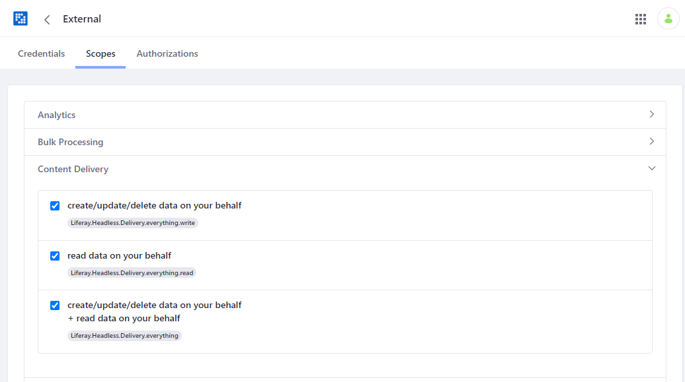

# Liferay External OAuth2 Authorization server support

This project illustrates a possible solution for Liferay headless APIs to rely on
an external OAuth2 Authorization Server.

Keycloak creates access tokens in the JWT format (https://tools.ietf.org/html/draft-ietf-oauth-access-token-jwt-07).
This format makes it possible for the Resource server to validate access tokens autonomously thanks to the exposition of
a JWKS URL displaying the authorization server's certificates.


Another possibility would be to rely on token introspection (https://tools.ietf.org/html/rfc7662).
We could write a similar AuthVerifier implementing this policy.

This project has been tested using Keycloak as the Authorization server.

## Code highlights

In order to make this work, we have to provide 2 components:

1. An implementation of `com.liferay.portal.kernel.security.auth.verifier.AuthVerifier` that validates the token delivered
by Keycloak:

[ExternalOAuthValidator.java](./modules/external-oauth-validator/src/main/java/com/liferay/samples/fbo/oauth/validator/ExternalOAuthValidator.java)

2. A component implementating both `com.liferay.oauth2.provider.scope.ScopeChecker` and `com.liferay.oauth2.provider.scope.liferay.ScopeContext`
that will be responsible to validate that the access token bears the scopes required to make the API calls:

[ExternalScopeChecker.java](./modules/external-oauth-validator/src/main/java/com/liferay/samples/fbo/oauth/validator/ExternalScopeChecker.java)

## Setup and configuration

### Configuring Keycloak

Create a **Client scope** for each of the OAuth2 Authorization scopes defined in Liferay.
You can browse the list of scopes inside of *Control Panel -> SECURITY -> OAuth 2 Administration*, selecting a client in the list and looking at the *Scopes* list.
Example: `Liferay.Headless.Delivery.everything.read`


Create a **Client** and add the authorized optional scopes the client can request in a token.


Create a **User** that should match with a User existing in Liferay:


It's important that the screen name matches Liferay's.

In real life, users should be synchronized between Liferay and Keycloak:

+ Either because Liferay and Keycloak will rely on the same LDAP
+ Or Liferay relies on Keycloak as an ID Provider either using the OpenID Connect or SAML protocol

### Configuring Liferay

Go to *Control Panel -> SECURITY -> OAuth 2 Administration* and create a dummy external client.


Give this client all the scopes you expect the external Authorization server to be able to deliver:



Creating this dummy client is required by Liferay's `com.liferay.portal.kernel.security.auth.verifier.AuthVerifier` contract
since a succesful verification requires to provide an `com.liferay.portal.kernel.security.auth.verifier.AuthVerifierResult` object
containing a `com.liferay.oauth2.provider.rest.spi.bearer.token.provider.BearerTokenProvider.AccessToken` referencing a
`com.liferay.oauth2.provider.model.OAuth2Application.OAuth2Application` object.

### Configuring the External OAuth2 Authorization server support module

Create a file named `com.liferay.portal.security.auth.verifier.internal.tracker.AuthVerifierFilterTracker.config` inside of `/osgi/configs` with the following contents:

```
default.registration.property = [ \
  "filter.init.auth.verifier.BasicAuthHeaderAuthVerifier.urls.includes\=/*", \
  "filter.init.auth.verifier.ExternalOAuthValidator.urls.includes\=*", \
  ]
```
Open the Gogo shell and use the `lb` command to locate the bundle ID for `Liferay OAuth2 Provider REST`.
Then execute `refresh xxx` where `xxx` is the bundle ID. This is necessary to update the references to the new `ScopeContext` / `ScopeChecker` OSGi Service.
This is not necessary after a Liferay server restart.

Now look for *External OAuth Configuration* inside of *Control Panel -> Configuration -> Instance Settings*.


And provide the following settings:


The first one can be retrieved from Keycloak here:


The second one is the name of the **scope** claim in the JWT token. For Keycloak, it's `scope`.
Use https://jwt.io to analyze the contents of tokens generated by Keycloak.

The third one is the name of the claim that contains the value of the authenticated user's screen name.
By default, Keycloak puts it inside of `preferred_username`.

The fourth one is the Client ID of the dummy client we have configured in Liferay.

## Testing with Postman

First, create a blog post and determine its ID.

We're going to hit the blogs headless API using this URL: http://localhost:8080/o/headless-delivery/v1.0/blog-postings/35901 where `35901` is to be replaced by the ID of the blog post.

Using Postman, request an OAuth 2 access token:


Use the access token you obtained to make a request to the API.

Watch the HTTP status: you should either get 200 or 403 and have a look at the logs to see what's wrong. Activate DEBUG logs on `com.liferay.samples.fbo.oauth.validator.ExternalOAuthValidator` and
`com.liferay.samples.fbo.oauth.validator.ExternalScopeChecker`.

Now, change the permissions on the blog post so that the authenticated user should be denied access to it.
Try again the API call, you should get 404 (this is Liferay standard behaviour instead of shooting 403).
